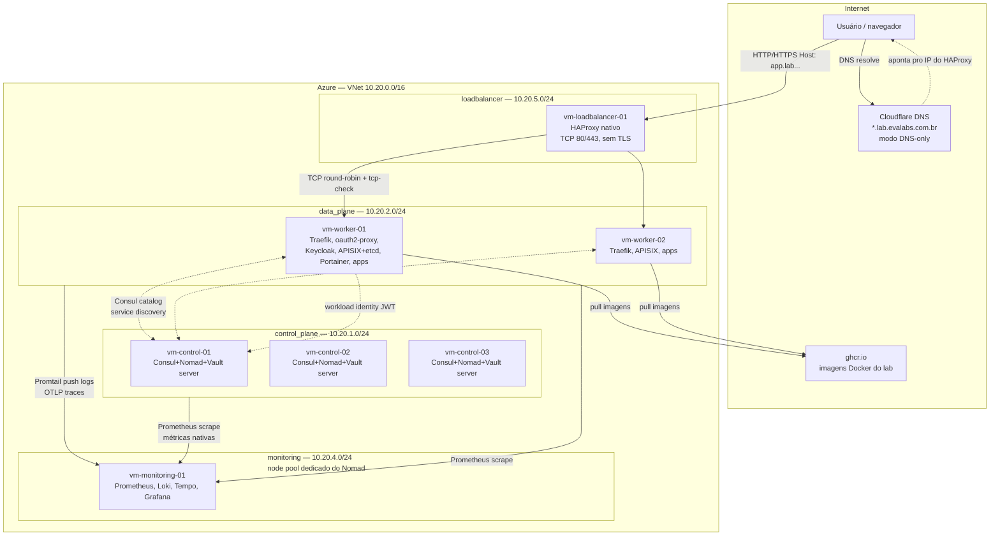
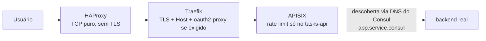
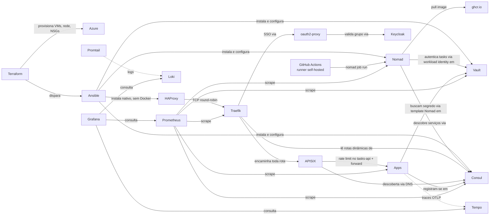

# Arquitetura do lab HashiCorp

Este laboratório roda inteiramente na Azure (East US 2), numa única VNet
`10.20.0.0/16` dividida em sub-redes, uma por "papel". Duas outras já
existiram e foram desligadas ao longo do lab — `registry` (10.20.3.0/24,
o Harbor, ver [Registry de imagens](09-harbor)) e o **bastion** (testado
e removido, ver seção "Acesso SSH" abaixo):

| Sub-rede        | CIDR          | O que roda lá |
|-----------------|---------------|----------------|
| `control_plane` | 10.20.1.0/24  | Consul+Nomad+Vault (servers), runners self-hosted do GitHub Actions |
| `data_plane`    | 10.20.2.0/24  | Consul+Nomad (clients), Traefik, oauth2-proxy, APISIX+etcd, Keycloak+Postgres, Portainer, aplicações |
| `monitoring`    | 10.20.4.0/24  | Prometheus, Loki, Tempo, Grafana, Promtail, node-exporter |
| `loadbalancer`  | 10.20.5.0/24  | HAProxy nativo (sem Docker/Consul/Nomad) |

Imagens Docker construídas neste lab vêm do **GitHub Container Registry
(ghcr.io)** — não existe mais registry próprio dentro da VNet.

**Toda** rota do lab — as 4 aplicações públicas e as ferramentas
administrativas atrás de SSO — passa por uma peça a mais entre o
Traefik e o backend real: um API Gateway (APISIX), descobrindo cada
serviço via DNS do Consul:

O SSO (`oauth2-proxy`) continua sendo resolvido no Traefik, antes de
chegar no APISIX — o gateway não sabe nada sobre autenticação, só
descobre e encaminha. Ver [APISIX](13-apisix) pro porquê dessa peça
existir (inclusive por que **Apache APISIX** foi escolhido entre
KrakenD/Kong/APISIX), por que ela cobre tudo e os bugs reais que
apareceram montando essa descoberta. Ver [Keycloak SSO](07-keycloak-sso)
pro RBAC por grupo (`dev`/`devops`) e a troca do `forward-auth` pelo
`oauth2-proxy`.

## Por que essa divisão

- **Control plane isolado dos workers**: os servers de Consul/Nomad/Vault
  não rodam aplicações — só coordenam o cluster. Se um worker cair ou ficar
  sobrecarregado, o cérebro do cluster continua saudável.
- **Registry fora da VNet por completo**: chegou a existir uma VM
  própria (Harbor) só pra isso — foi desligada depois de migrar pro
  ghcr.io. Ver [Registry de imagens](09-harbor).
- **Monitoring isolado por node pool do Nomad**: Prometheus/Loki ingerem
  dado o tempo todo — um *node pool* dedicado (`monitoring`) garante
  isolamento de verdade: jobs desse pool só agendam nesse nó, e as
  aplicações nunca são agendadas lá. Veja [Nomad](04-nomad).
- **Loadbalancer numa VM própria, fora do cluster**: essa VM não é
  client Nomad, não roda Docker nem participa do Consul — só encaminha
  TCP fixo pros 2 workers, que já são endereços conhecidos e estáticos.
  Colocar Consul/Nomad ali seria complexidade sem necessidade. **Trade-off
  aceito de propósito**: diferente do Load Balancer da Azure (que
  sobrevivia à queda de 1 worker via health probe), essa VM única é
  agora o ponto único de falha da borda — decisão consciente, feita
  como exercício de aprendizado (ver "Do Load Balancer da Azure ao
  HAProxy" abaixo).

## Do Load Balancer da Azure ao HAProxy

O lab começou com um **Standard Load Balancer** da Azure na borda —
gerenciado, sobrevivia à queda de 1 worker automaticamente, sem VM
própria pra manter. Foi substituído por uma VM de **HAProxy** rodando
nativo (sem container), só como exercício pra aprender como um load
balancer L4 funciona por dentro — não por custo (o LB gerenciado era
mais barato e mais resiliente).

- **HAProxy faz só TCP puro** (`mode tcp`) nas portas 80/443 — não
  termina TLS, não olha `Host`, só distribui a conexão por
  round-robin entre os 2 workers, com `tcp-check` tirando um worker
  doente da rotação sozinho. Quem faz TLS/roteamento continua sendo o
  Traefik, sem nenhuma mudança nele.
- **Convivência antes da troca**: os dois rodaram em paralelo até o DNS
  ser migrado e validado — o Azure LB só foi removido do Terraform
  depois de confirmar tráfego real passando pelo HAProxy.
- Ver [Terraform](01-terraform) pro código de ambos (o antigo
  `loadbalancer.tf`, removido, e o `module "loadbalancer"` atual).

## Acesso SSH

Cada VM aceita SSH direto, restrito ao IP configurado em
`allowed_ssh_cidr` (NSG). Chegamos a montar um **bastion** (VM única
com SSH exposto, todas as outras só aceitando conexão vinda dela) só
pra testar o padrão — arquitetura válida pra ambiente on-premise, onde
faz sentido ter um único ponto de entrada bem controlado pra rede
interna. Decidimos não manter: aqui o acesso é externo mesmo (não tem
"rede interna" separada da internet pra proteger), então a VM extra só
rodando `sshd` 24/7 era custo sem benefício real.

## RBAC por grupo (dev / devops)

Nem toda ferramenta atrás de SSO é visível pra todo mundo autenticado.
O Keycloak tem dois grupos no realm `lab`:

- **`dev`**: só as aplicações públicas + Grafana (qualquer usuário
  autenticado do realm entra no Grafana).
- **`devops`**: tudo que `dev` vê, mais Portainer, Prometheus, Vault UI
  e Nomad UI.

Isso é aplicado por **duas instâncias separadas do oauth2-proxy** (uma
sem `--allowed-group`, outra com `--allowed-group=devops`) — grupo novo
no futuro é só mais uma instância, copiando o padrão. Ver
[Keycloak SSO](07-keycloak-sso) pro porquê da troca do `forward-auth`
(não suportava RBAC por grupo) e os bugs reais encontrados montando
isso (client scope `groups`, loop de redirect, `KC_HOSTNAME`).

## Fluxo de uma requisição

1. Usuário acessa `https://algumacoisa.lab.evalabs.com.br`.
2. DNS (Cloudflare, registro wildcard `*.lab`, modo **DNS only**)
   resolve direto pro IP público da VM de **HAProxy**.
3. O **HAProxy** distribui (TCP puro, round-robin + `tcp-check`) entre
   os 2 workers.
4. **Traefik**, rodando em cada worker, recebe a requisição, termina
   TLS (Let's Encrypt, wildcard, desafio DNS-01), olha o `Host` header,
   e decide pra qual serviço rotear — a lista de rotas vem dinamicamente
   do **Consul catalog**. Se a rota exige SSO, o middleware
   `oauth2-proxy` (grupo `all` ou `devops`, conforme a ferramenta)
   intercepta antes e redireciona pro **Keycloak** se não houver
   sessão/grupo válido.
5. Toda rota, sem exceção, passa em seguida pelo **APISIX** — que
   descobre o backend real via DNS do Consul e aplica rate limiting na
   única API pública do lab (`tasks-api`) — ver [APISIX](13-apisix).
6. O serviço final (rodando como job Nomad) responde. Se ele precisa de
   segredo, um `template` no job Nomad busca o valor do **Vault** em
   tempo de execução, autenticado via **workload identity** (JWT
   assinado pelo próprio Nomad) — nunca em texto no job.
7. Em paralelo, **Promtail** (todo client Nomad) lê os logs de todo
   container via Docker socket e empurra pro **Loki**; apps
   instrumentadas mandam traces direto pro **Tempo**; o **Prometheus**
   faz scrape de métricas a cada 1 minuto.

## Vault: cuidado com o seal

O Vault usa seal **Shamir** (3 partes / limiar 2) — não auto-unseal.
As unseal keys + root token ficam só na máquina que rodou o bootstrap
(`.vault-init.json`, fora do repo). Se **1** dos 3 nós reiniciar, o
cluster continua saudável (os outros 2 seguem destravados); se os
**3** reiniciarem juntos, o Vault fica totalmente selado até alguém
destravar manualmente com 2 das 3 chaves — os dados nunca são
perdidos, só ficam inacessíveis até isso acontecer. Ver [Vault](05-vault)
pro procedimento de unseal e por que optamos por não migrar pra
auto-unseal neste lab.

A rota `vault-ui` do APISIX aponta especificamente pro **líder atual**
do Vault (`active.vault-ui.service.consul`, via auto-registro do Vault
no Consul com tags `active`/`standby`) — não round-robin cego entre os
3 nós. Sem isso, cair num nó standby faz a própria UI do Vault tentar
contatar a API do líder direto por IP privado, o que o navegador
bloqueia por CSP e trava o login com um erro sem nenhum registro no
log do Vault (parece bug de permissão, mas é só roteamento).

## Como as peças se conectam (dependência)

Cada peça tem sua própria página nesta documentação, com o que ela faz
neste lab especificamente e **como fazer a mesma coisa manualmente**
(sem Terraform/Ansible/CI), pra nunca depender só da automação sem
entender o que ela faz por baixo.
