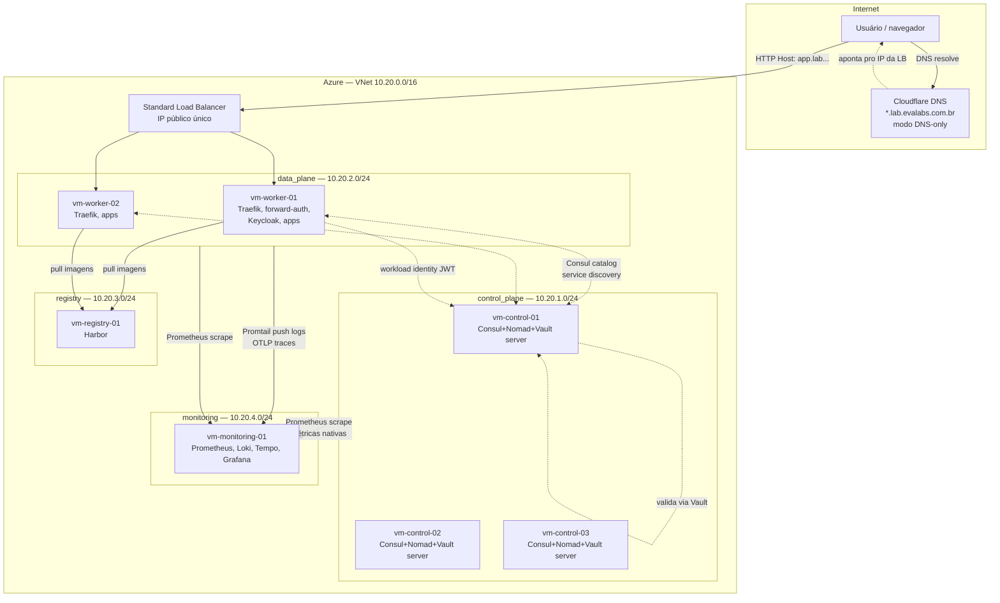
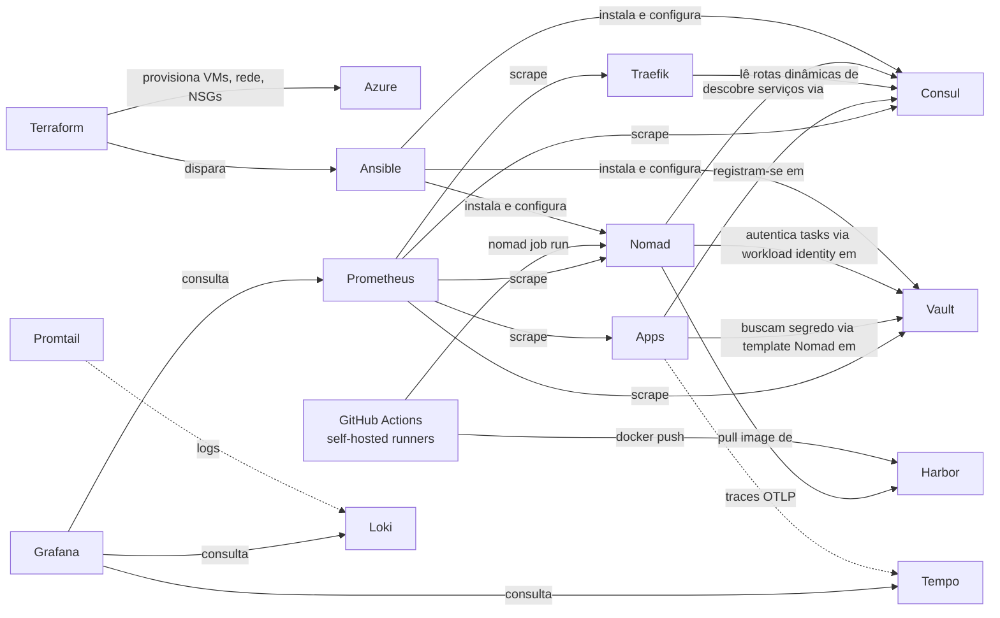

# Arquitetura do lab HashiCorp

Este laboratório roda inteiramente na Azure (East US 2), numa única VNet
`10.20.0.0/16` dividida em 4 sub-redes, uma por "papel":

| Sub-rede       | CIDR          | O que roda lá |
|----------------|---------------|----------------|
| `control_plane`| 10.20.1.0/24  | Consul+Nomad+Vault (servers), Keycloak, Postgres do Keycloak |
| `data_plane`   | 10.20.2.0/24  | Consul+Nomad (clients), Traefik, forward-auth, aplicações (loja, blog, tasks-app) |
| `registry`     | 10.20.3.0/24  | Harbor (registry de imagens Docker do lab) |
| `monitoring`   | 10.20.4.0/24  | Prometheus, Loki, Tempo, Grafana, Promtail, node-exporter |

## Por que essa divisão

- **Control plane isolado dos workers**: os servers de Consul/Nomad/Vault
  não rodam aplicações — só coordenam o cluster. Se um worker cair ou ficar
  sobrecarregado, o cérebro do cluster continua saudável.
- **Registry numa VM separada**: o Harbor guarda as imagens Docker que
  todo o resto do cluster puxa. Separar evita que um problema de disco/CPU
  no registry derrube aplicações já rodando (elas só falam com o registry
  no momento do deploy).
- **Monitoring isolado por node pool do Nomad** (não uma VM solta
  "invisível" pro Nomad): Prometheus/Loki ingerem dado o tempo todo — se
  dividissem host com as aplicações, competiriam por CPU/disco com elas.
  Um *node pool* dedicado (`monitoring`) garante isolamento de verdade:
  jobs desse pool só agendam nesse nó, e as aplicações (que não declaram
  `node_pool`, ficando implícitas no pool `default`) nunca são agendadas
  lá. Veja [Nomad](04-nomad) pra entender node pools.

## Fluxo de uma requisição

1. Usuário acessa `https://algumacoisa.lab.evalabs.com.br`.
2. DNS (Cloudflare, registro wildcard `*.lab`, modo **DNS only** — sem
   proxy/CDN da Cloudflare no meio) resolve direto pro IP público do
   **Load Balancer** da Azure.
3. A LB distribui entre os 2 workers (health probe TCP na porta 80).
4. **Traefik**, rodando em cada worker, recebe a requisição, olha o
   `Host` header, e decide pra qual serviço rotear — a lista de rotas vem
   dinamicamente do **Consul catalog** (provider `consulcatalog`), não de
   arquivo estático.
5. Se a rota exige SSO (Vault UI, Portainer, Grafana, Nomad UI, o próprio
   dashboard do Traefik), o middleware `forward-auth` intercepta antes e
   redireciona pro **Keycloak** se não houver sessão válida.
6. O serviço final (rodando como job Nomad) responde. Se ele precisa de
   segredo (senha de banco, chave de API), ele nunca tem a senha em texto
   — um `template` no job Nomad busca o valor do **Vault** em tempo de
   execução, autenticado via **workload identity** (um JWT assinado pelo
   próprio Nomad).
7. Em paralelo, **Promtail** (rodando em todo client Nomad) está lendo os
   logs de todo container via Docker socket e empurrando pro **Loki**; se
   a aplicação está instrumentada com OpenTelemetry, ela manda traces
   direto pro **Tempo**; o **Prometheus** faz scrape de métricas
   (Consul/Nomad/Vault/Traefik nativas + `/metrics` de cada app) a cada 1
   minuto.

## Como as peças se conectam (dependência)

Cada peça tem sua própria página nesta documentação, com o que ela faz
neste lab especificamente e **como fazer a mesma coisa manualmente**
(sem Terraform/Ansible/CI), pra nunca depender só da automação sem
entender o que ela faz por baixo.
